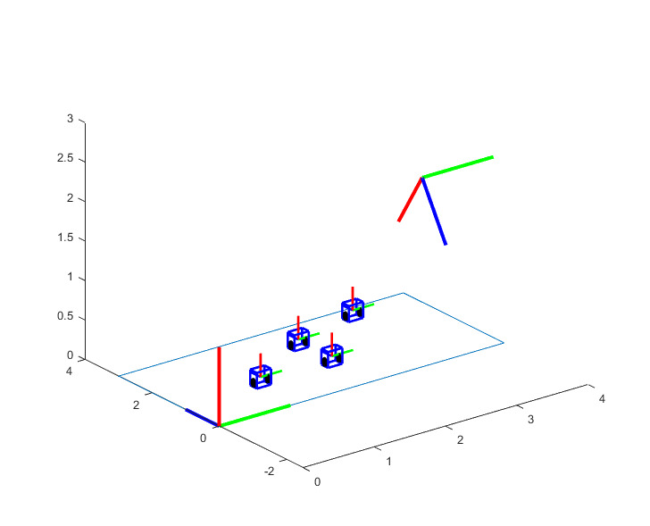
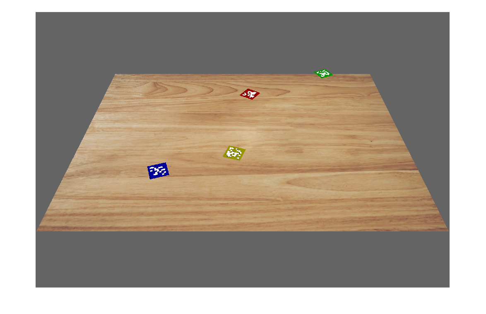
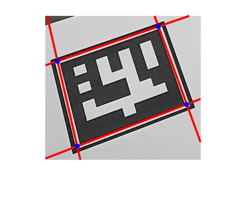

# 👁️ Computer Vision Course Portfolio

This repository showcases a comprehensive set of projects implemented in **MATLAB**, covering fundamental to advanced topics in image processing, geometric computer vision, and pattern recognition.

---

## 📂 Projects

### 1. 📐 Camera Calibration and Homography
*Focus: Geometric Vision & 3D Projections*

This project explores how cameras perceive the 3D world and how to project virtual objects onto a 2D image plane with high precision.

- **3D Robot Simulation:** Representation of virtual 3D robots (cubes) with **Aruco markers** on top, allowing for precise spatial localization.
- **Intrinsic & Extrinsic Parameters:** Implementation of focal length, principal point, and rotation/translation matrices to simulate realistic camera physics.
- **Homography-Based Projection:** Mathematical mapping of coordinates to project the Aruco markers and robot bodies onto the table with the **chosen perspective**.
- **Dynamic Simulations:** Scripts to simulate moving 3D robots and changing camera views within an augmented reality environment.

**Topics covered:**
- [x] **Pinhole Camera Model:** Understanding intrinsic parameters (K) and extrinsic transformations ([R|t]).
- [x] **Homography Calculation:** Implementing SVD-based Direct Linear Transform (DLT) to solve the homography matrix H.
- [x] **3D-to-2D Projection:** Transforming world coordinates into image pixels for augmented reality.
- [x] **Image Composition:** Blending virtual objects with real-world backgrounds using transparency and perspective.

**Execution:**
1. Open MATLAB.
2. Navigate to the `01_Camera_Calibration_and_Homography/Matlab` folder.
3. Run the main script `main_execution_script.m` section by section to see the results.

#### 📊 Extraction Results:

| 🧊 Dinamic 3D Rendering | 🎞️ Perspective Motion |
| :---: | :---: |
|    *3D cubes and camera frame correctly rendered on the table.* |    *Dynamic perspective update from the camera frame.* |

#### 🎥 Visual Demos:
- 🧊 [3D Cube Projection & Shading](01_Camera_Calibration_and_Homography/results/3D-Cubes.mp4) - *Demonstration of overlapping 3D volumes on a planar surface.*
- 🏁 [Moving Aruco Markers](01_Camera_Calibration_and_Homography/results/ArucosColor.mp4) - *Real-time animation of markers with perspective updates.*
- 🎥 [Virtual Camera Flight](01_Camera_Calibration_and_Homography/results/CubesCamara.mp4) - *Simulation of a moving observer view.*

---

### 2. 🥦 Vegetable Segmentation and Classification
*Focus: Image Processing & Feature Extraction*

Development of an automated pipeline to detect, segment, and identify different types of vegetables within a scene using advanced image processing.

- **Intelligent Segmentation:** Using HSL and RGB color-space thresholds to isolate specific vegetable species from complex backgrounds.
- **Morphological Refinement:** Applying cleanup operations (`imopen`, `imclose`) and binary labeling to isolate individual objects.
- **Automated Classification:** Extracting geometric features (Area, Eccentricity, Bounding Boxes) to distinguish between different types of vegetables.
- **Multi-Instance Detection:** Capability to detect and count multiple instances of the same vegetable type or classify a diverse set of species simultaneously.

**Topics covered:**
- [x] **Color Segmentation:** Exploring RGB, HSL, and Lab spaces to isolate objects by chromaticity.
- [x] **Adaptive Thresholding:** Handling non-uniform lighting conditions with local binarization techniques.
- [x] **Morphological Ops:** Using Erosion, Dilation, and Fill to refine segmented object masks.
- [x] **Connected Component Analysis:** Extracting region properties (Area, Centroid, Bounding Box) for labeling.

**Execution:**
1. Open MATLAB.
2. Navigate to the `02_Vegetable_Segmentation_and_Classification/Matlab` folder.
3. Run the main script `vegetable_classification.m` with the desired image path to see the results.

#### 📊 Extraction Results:

| Classification of Different Vegetables | Multiple Objects of the Same Type |
| :---: | :---: |
|    *Automatic classification of various species (Kiwis, Tomatoes, Peppers, etc.).* |    *Segmentation and individual count of multiple instances of the same vegetable.* |

---

### 3. 🛡️ Marker Detection and Homography Solve
*Focus: Template Matching & Image Rectification*

Advanced system for the detection and identification of planar markers (similar to Aruco/QR) to reconstruct scene geometry.

- **Marker Identification:** Scanning complex scenes for potential candidates and verifying their identity using binary template matching.
- **Perspective Rectification:** Using **4-point homography** to "flatten" tilted or distorted markers into a canonical view for reliable identification.
- **Geometric Verification:** High-precision corner extraction and coordinate mapping to handle lighting variations and occlusions.

**Topics covered:**
- [x] **Marker Geometry:** Identification of square patterns and corner extraction in noisy images.
- [x] **Homography-based Rectification:** Warping tilted markers into a canonical frontal view for identification.
- [x] **Template Correlation:** Matching detected patches against known marker definitions.
- [x] **Inverse Projection:** Mapping marker IDs back into the scene with accurate spatial alignment.

**Execution:**
1. Open MATLAB.
2. Navigate to the `03_Homography_and_Marker_Detection/Matlab` folder.
3. Run the script `marker_detection_basic.m` or `marker_detection_advanced.m` with the desired image path to see the results.

#### 📍 Detection Output:

| Aruco Intersection Logic | Final Marker Mapping |
| :---: | :---: |
|    *Detail of the geometric intersection points used for homography estimation.* |    *Visual confirmation of detected markers with their corresponding IDs and accuracy indicators.* |

---

### 4. 🔢 MNIST Handwritten Digit Recognition
*Focus: Pattern Recognition & Machine Learning*

Implementation of a complete pattern recognition system for the classification of handwritten digits using the historical MNIST dataset.

- **Dataset Processing:** Loading and pre-processing 70,000 samples (60k train / 10k test) of diverse handwritten numbers.
- **Statistical Classifiers:** Implementation of a **Mahalanobis Distance** classifier to handle high-dimensional feature distributions.
- **Feature Optimization:** Using **Fisher's Linear Discriminant Analysis (LDA)** to project data into an optimal space that maximizes class separability and accuracy.

**Topics covered:**
- [x] **Feature Vector Construction:** Flattening 2D images into high-dimensional vectors for processing.
- [x] **Supervised Learning:** Training models on labeled data and evaluating on unseen test sets.
- [x] **Mahalanobis Distance:** Statistical classification considering the covariance of the data distribution.
- [x] **Fisher's LDA:** Maximizing class separability in reduced feature spaces for higher accuracy.

**Execution:**
1. Open MATLAB.
2. Navigate to the `04_MNIST_Handwritten_Digit_Recognition/Matlab` folder.
3. Run the script `mnist_recognition_basic.m` or `mnist_recognition_advanced.m` with the desired dataset path to see the results.

#### 📈 Recognition Performance:

| ✅ Success Sample | ❌ Failure Sample |
| :---: | :---: |
|    *Correctly classified digit with high confidence.* |    *Failure due to the digit being poorly drawn.* |

- 📼 [Full Digit Recognition Demo](04_MNIST_Handwritten_Digit_Recognition/results/mnist_recognition_demo.mkv)

---

## 🛠️ Getting Started

### Prerequisites
- **MATLAB** (R2021a or newer recommended).
- **Image Processing Toolbox**.

---
Developed by **Fernando Román** and **Andrés Martínez** | *Computer Vision Course, University of Seville*
